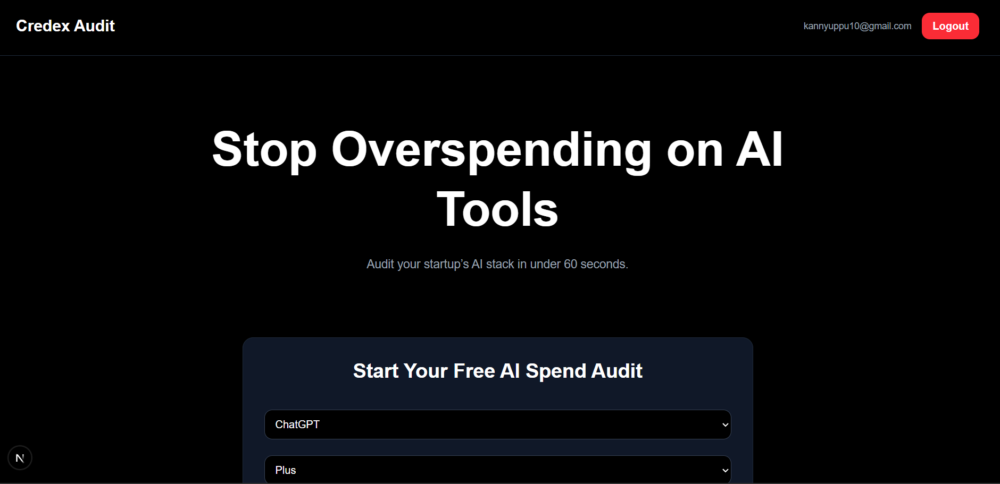
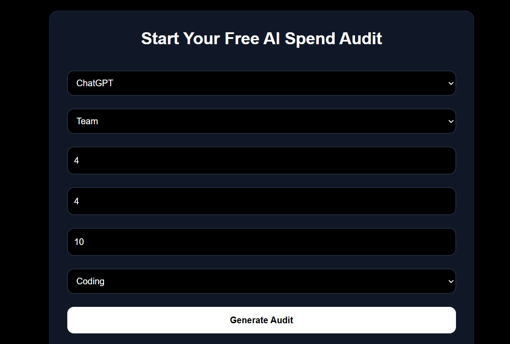
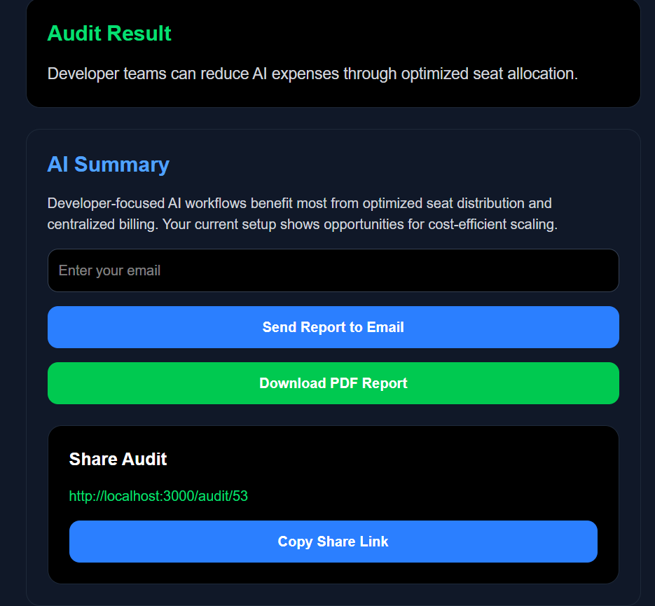
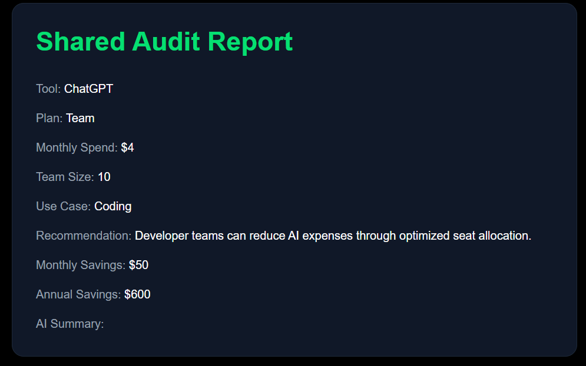
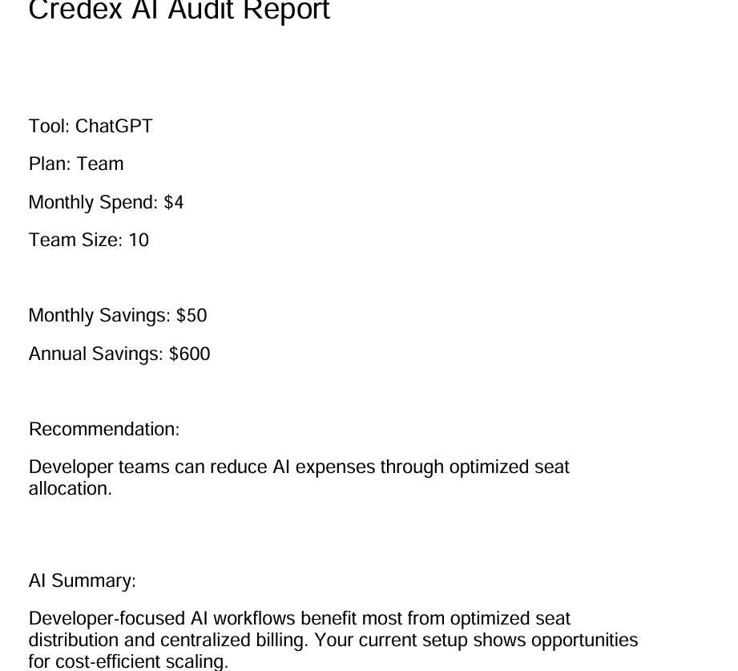
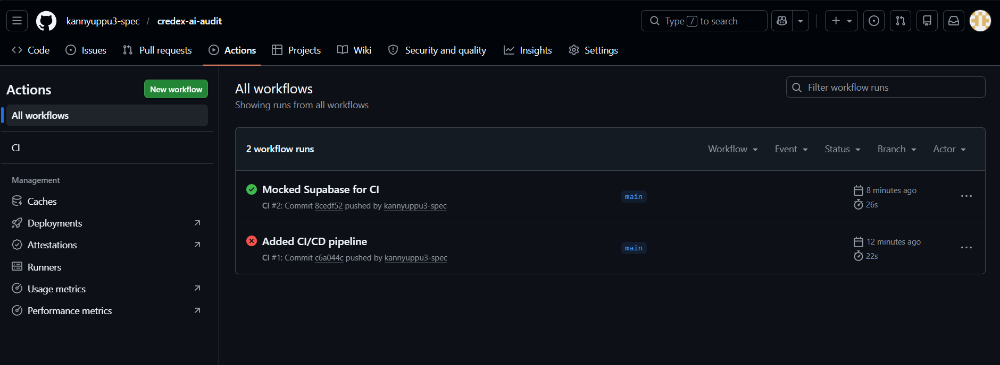

# Credex AI Audit

AI-powered SaaS platform that helps startups analyze, optimize, and reduce AI tool spending through intelligent audit reports, savings recommendations, and automated insights.


## Live Demo

https://your-vercel-link.vercel.app

## Features

- AI-generated spend analysis
- Savings optimization engine
- Google authentication
- Shareable audit reports
- PDF export
- Email delivery
- SEO optimization
- CI/CD automation
- Responsive SaaS dashboard

## Tech Stack

- Next.js
- TypeScript
- Tailwind CSS
- Supabase
- OpenAI API
- Resend
- Jest
- GitHub Actions

## Project Structure

```bash
app/
components/
lib/
public/
__tests__/
.github/workflows/
```
## Key Learnings

- Building production-grade SaaS apps
- Authentication with Supabase
- Dynamic routing in Next.js
- API route handling
- Automated testing with Jest
- CI/CD pipelines with GitHub Actions
- Performance optimization
- SEO best practices
## Installation

```bash
npm install
npm run dev
```

## Environment Variables

Create `.env.local`

```env
NEXT_PUBLIC_SUPABASE_URL=
NEXT_PUBLIC_SUPABASE_ANON_KEY=
OPENAI_API_KEY=
RESEND_API_KEY=
```

## Running Tests

```bash
npm test
```
## Screenshots








## Deployment

Deployed on Vercel.